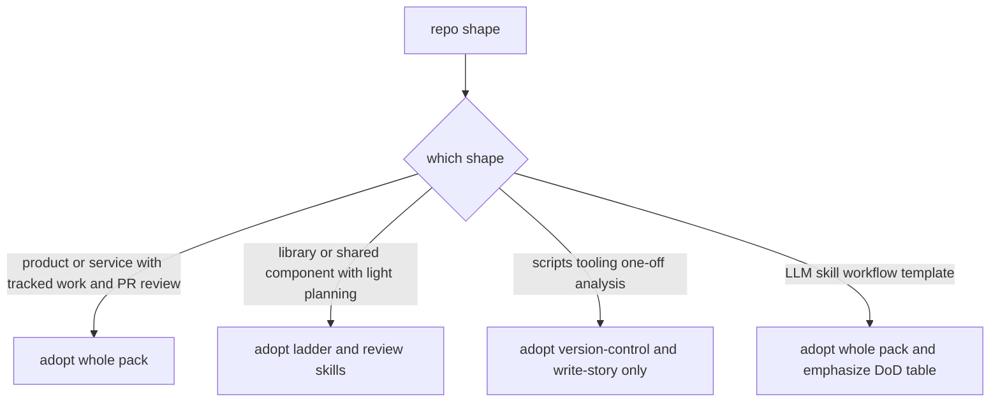
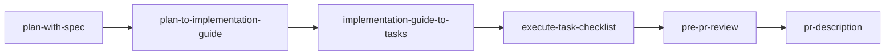

# Bootstrap: Adopting This In A New Repo

Work this list once per repo. It should take under an hour, most of it spent on step 4.

The design intent: **every project-specific value lives in exactly one file**
(`.claude/workflow-config.md`), and every skill reads it. Do not edit project specifics
into the skill bodies — that is how twelve skills drift into twelve different opinions
about what the test command is.

---

## 0. Decide whether this repo wants the whole pack

Be honest here. The four-rung ladder pays for itself on work that is planned, reviewed and
merged by more than one person. It is ceremony on a scratch repo.



| Repo shape | Take |
|---|---|
| Product or service with tracked work items and PR review | The whole pack |
| Library or shared component, reviewed but lightly planned | Ladder + review skills; skip `e2e-verification` |
| Scripts, tooling, one-off analysis | `version-control` and `write-story` only. No spec folders. |
| LLM skill workflow template | Whole pack, but the DoD table matters more than the test command |

If you take a subset, record the decision in the repo's `CLAUDE.md` so the next person does
not read the absence as an oversight.

---

## 1. Install the prerequisite plugin

The skills in this pack **require** the `superpowers` plugin. They invoke it directly and
have no fallbacks.

```
/plugin marketplace add claude-plugins-official
/plugin install superpowers
```

Verify it loaded: `superpowers:brainstorming`, `superpowers:test-driven-development` and
`superpowers:subagent-driven-development` should appear in the available-skills list.

See `reference/superpowers-required.md` for which plugin skills are load-bearing where, and
what degrades if one is missing.

---

## 2. Copy the files in

```
cp -r skills/*        <repo>/.claude/skills/
cp    hooks/*         <repo>/.claude/hooks/
cp    templates/workflow-config.md   <repo>/.claude/workflow-config.md
```

Delete the skill directories you decided against in step 0.

Then wire the hook into `<repo>/.claude/settings.json` — see
`reference/harness-setup.md` for the block to paste and why this hook exists.

---

## 3. Gitignore the spec folder and the scratch paths

```gitignore
# Per-item working material: plans, guides, task checklists, reviews, ad-hoc
# queries and samples. Dated and disposable; would drown a code review.
specs/
```

Story drafts and tracker payloads go **outside the repo entirely** — pick a scratch
directory and record it in the config file in step 4. They are narrative prose about work,
and they should never appear in a code review.

---

## 4. Fill in `.claude/workflow-config.md`

This is the whole localization surface. Open the copied template and fill every field.
Leave nothing as a placeholder — a skill that reads `<TEST_COMMAND>` will run it.

The fields, and what goes wrong if you get them wrong:

### Commands

- **Unit test command, full suite and single-path forms.** Invoke tooling through the
  repo's documented entrypoint, not by activating an environment in the shell — an
  activated venv does not survive between tool calls. If the runner needs an environment
  variable set at import time, put it in the command string.
- **Lint / format check.** If the repo carries a pre-existing lint backlog, say so here and
  **scope lint to changed paths**. A repo-wide run against a dirty baseline cannot tell a
  task's own regressions from inherited noise.
- **Integration and E2E commands**, if they exist, and what they cost to run.
- **Any spec/schema validation** — OpenAPI lint, protobuf check, migration dry-run.

### Repo facts

- **Base branch.** Do not write `main` and assume. Some repos have an abandoned branch that
  `git symbolic-ref refs/remotes/origin/HEAD` still points at. State the real base, and the
  skills will still resolve it by comparing candidate tip dates and telling you which they
  chose.
- **Spec folder convention** — `specs/{itemId}/`, or the repo's equivalent, or "none".
- **Branch-name shapes** the item id can be parsed from. Support every shape actually in
  use; skills ask rather than guess when parsing fails.
- **Scratch directory** for story drafts and tracker payloads, outside the repo.
- **Test locations and naming convention**, and how integration tests are marked.

### Definition of Done, keyed to file type

Not one checklist — a lookup on what actually changed. Start from this and adapt:

| What changed | What is required |
|---|---|
| Runtime behavior | Unit tests in the repo's test location + lint/format check |
| API / schema definition | Its validation command |
| Documentation only | No new tests |
| Pipeline / deployment config | Explicit reviewer note describing deployment impact |
| Generated file | The generator ran, and the check that generated-matches-committed |

### Decision surfaces

**The most important field, and the one people skip.** These are the recurring areas where
this project makes non-obvious choices. They become the tags on knowledge articles and the
axis `recall` filters on, so a bad vocabulary here makes the knowledge base unsearchable
later.

Aim for six to twelve. Derive them from where your last several items actually made
arguable decisions — not from your directory names.

Two failure modes to avoid, both observed in practice:

- **A declared surface no article ever uses.** Dead vocabulary; retire it.
- **One surface swallowing everything.** If most articles carry the same tag, it is not a
  filter. Split it.

### Tracker

Which tracker, the field mapping for work items, and the estimate unit. See
`reference/tracker-integration.md`.

---

## 5. Seed the knowledge base

```
mkdir -p <repo>/docs/knowledge
cp templates/knowledge-README.md <repo>/docs/knowledge/README.md
```

Fill in the surface list from step 4 so it matches the config file exactly. `recall` reads
this index first; if the vocabulary here disagrees with the config, articles get tagged one
way and searched another.

Commit it empty. An empty indexed base is ready; an unindexed article is invisible.

---

## 6. Write or extend the repo's `CLAUDE.md`

Short and factual. What the project is, key directories, the commands, testing
conventions. Do not restate the workflow — that is what this pack is for.

Do put in `CLAUDE.md` anything you want to hold *regardless of what any session decides* —
and then ask whether it should be a **hook** instead. Guidance can be read and
rationalized past; a `PreToolUse` hook is enforced by the harness. That distinction is the
single most useful configuration idea in this pack, and `hooks/block_compound_bash.py` is a
worked example of it.

---

## 7. Do a dry run on one real work item

Take a genuinely small item through the whole chain: `plan-with-spec` →
`plan-to-implementation-guide` → `implementation-guide-to-tasks` →
`execute-task-checklist` → `pre-pr-review` → `pr-description`.



You are testing the config, not the item. Watch for:

- A skill quoting a command that does not exist, or that needs an environment variable you
  did not record.
- The item id failing to parse from your branch name.
- The DoD table not covering a file type your repo actually has.
- Questions being asked that the config should already answer.

Fix `.claude/workflow-config.md`, not the skill.

Then run `compound` and see whether it produces anything. On a first item it often should
not — and *"No durable knowledge extracted"* is the correct output, not a failure.

---

## 8. Commit the pack

Commit the skills, the hook, the config file, the knowledge index and the gitignore change
together. From here they are the team's, not yours.

---

## Keeping it healthy

A few habits that prevent the failure modes this pack was shaped by:

- **Never edit project specifics into a skill body.** They go in the config file. If a
  skill genuinely needs a new field, add the field.
- **If you improve a skill, improve it where the repo can see it.** Iterating on a
  personal copy at `~/.claude/skills/` is convenient and it works — but a bare
  `/plan-with-spec` resolves to the *personal* copy, so the repo's committed version can
  sit unused while you keep running yours. Either finish the change in the repo, or address
  the repo copy explicitly by its scoped name.
- **Check the knowledge index against its files after any merge that touched
  `docs/knowledge/`.** Both are text and merge as text, so a branch can carry an index row
  whose article never merged, or lag main and sweep fewer articles than exist — with no
  signal either way. Have `recall` state the article count a sweep actually covered.
- **Merge the base branch before treating a trap sweep as complete.** A sweep on a stale
  branch reports full coverage of an incomplete base.
- **Delete a skill that nothing invokes.** Maintaining an unused skill in two places
  is pure drift.
