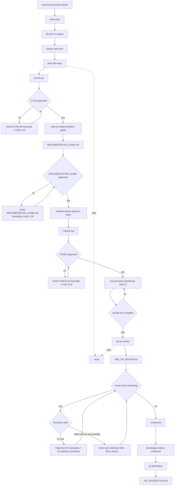
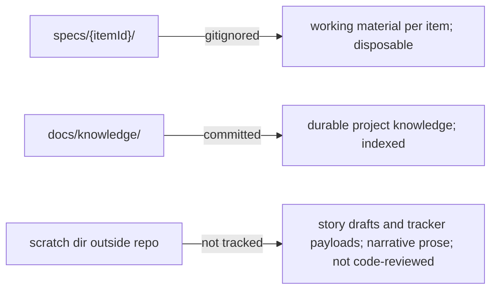

# A Spec-Driven Delivery Workflow

A portable set of Claude Code skills and conventions for taking a tracker work item to a
merged pull request, with an evidence trail at every step and a knowledge base that stops
the same lesson being learned twice.

This pack is stack-agnostic. It assumes only: a git repo, a work tracker, a test command,
and Claude Code with the `superpowers` plugin installed.

## What is here

| Path | What it is |
|---|---|
| `BOOTSTRAP.md` | The checklist to adopt this in a new repo. **Start here.** |
| `skills/` | Twelve skills. Copy into the repo's `.claude/skills/`. |
| `skills/DOMAIN-SKILL-TEMPLATE.md` | How to write the project-specific skills that matter most |
| `templates/workflow-config.md` | **The single localization surface.** Every skill reads it. |
| `templates/knowledge-README.md` | Knowledge-base index seed |
| `templates/story-draft.md` | The work-item draft format, as a standalone reference |
| `hooks/` | `block_compound_bash.py` — copies verbatim, no localization |
| `reference/harness-setup.md` | `settings.json`, permissions, hooks, model and effort |
| `reference/superpowers-required.md` | Which plugin skills are load-bearing, and where |
| `reference/tracker-integration.md` | Reading and writing tracker items from the shell |

## The shape of the thing

Work moves through four artifacts, each produced by its own skill, each a narrowing of the
last. Delivery starts from an official tracker item. If work is discovered ad hoc, capture
it with `write-story` and file it in your tracker first. The artifacts live in a per-item
spec folder — `specs/{itemId}/` — which is **gitignored**.



Two skills sit outside the line and are invoked by the others:

- **`recall`** — the single definition of how prior knowledge is selected. `plan-with-spec`
  calls it before forming questions; `pre-pr-review` calls it to sweep for reintroduced
  traps. You rarely invoke it by hand.
- **`write-story`** — the single definition of the work-item format. `compound` calls it
  for work that its findings imply; you call it directly whenever you find something that
  needs capturing but does not belong in the current item. File that item into your
  tracker before it enters the planning ladder.

Plus three support skills: `version-control`, `e2e-verification`, and whatever domain
skills your repo grows (see `skills/DOMAIN-SKILL-TEMPLATE.md`).

## Why it is built this way

Six ideas do the real work. Everything else is detail, and if you adapt this pack, these
are the parts to keep.

### 1. Each artifact answers one question and is forbidden from answering the next

`PLAN.md` says *why* and is explicitly barred from implementation steps.
`IMPLEMENTATION_GUIDE.md` says *how*. `TASKS.md` says *in what order, verified how*.

This is not tidiness. A plan that has drifted into steps cannot be reviewed as a scope
decision — the reviewer ends up checking whether the steps are right instead of whether
the scope is. Keeping the rungs separate is what makes each one reviewable on its own
terms, and what lets you throw away the guide and rebuild it without touching the plan.

### 2. One question at a time, with options and a recommendation

Every planning skill carries the same instruction: present each open question **one at a
time**, as *Question / Options / Recommendation*, and wait for the answer before asking
the next.

Never batch. A batch invites a batch answer, and the third question's right answer usually
depends on how the first was resolved. Every question carries realistic labelled options
and a recommendation with a one-sentence reason — an open-ended question hands the work
back to the person who asked for it.

Then **weave the answers in as though they had always been there.** No Q&A appendix, no
"Decisions" section recording the interrogation. The artifact must read as one coherent
decision, because that is how it will be read in three weeks by someone who was not
present.

### 3. Uncertainty is converted, never carried

Any uncertain item becomes an explicit decision: committed now, or excluded from this
item. Optional paths, nice-to-haves and alternatives are stripped unless the user asks for
them. Each skill ends with a pass whose only job is removing them.

An artifact with an open question in it is a decision deferred to implementation time,
which is the worst moment to make it.

### 4. Done means proven, and the proof is recorded

A task is complete only when **acceptance criteria are met, and verification passes, and
the checklist is marked, and the commit exists.** Four conjuncts, no shortcuts. Trimmed
command output goes into `TASKS.md` as evidence.

`pre-pr-review` will not mark an acceptance criterion verified from a code skim when a
command could be run instead, and says so explicitly when no automated check exists.

Two refinements worth adopting from the start:

- **Test-first, failing for the right reason.** Write the assertion, confirm it fails *for
  the reason you expect*, then implement. A test that fails for the wrong reason proves
  nothing about what you are building.
- **Mutation-proof any guard.** Break the guard, confirm red, restore. A guard that was
  never seen to fail is not known to work — and "the suite is green" carries no
  information about a guard nothing exercises.

### 5. Traceability lives in commits and `TASKS.md` — never in source

Never add a comment, docstring, test name or identifier citing a task id, item number, or
spec section. Commit messages carry the chain:

```
Task <ID>: <Short Description> (Plan <ItemId> → Guide → Task <ID>)
```

The reason is concrete: the spec folder is gitignored, so a source comment pointing at
`specs/1234/TASKS.md` points at a file no reader can open. Comments explaining the
functional *why* are encouraged — write the reason itself, stripped of the citation.

### 6. Retrieval is automatic; writing is deliberate

`recall` is wired into planning and pre-PR review rather than left to memory, because a
step you have to remember is a step you will skip on the day you are busy.

`compound` is invoked deliberately, and **twice**: once at review time, and again days
later when real-world evidence arrives. The second run matters more. The gap between what
a plan predicted and what production actually did is where the expensive lessons live, and
a review-time-only extraction cannot see it.

## The spec folder is disposable; the knowledge base is not

`specs/{itemId}/` is gitignored on purpose. It holds plans, guides, task checklists,
reviews, ad-hoc queries and sample data — dated working material that would drown a code
review if it were tracked.

The consequence is worth stating plainly, because it drives several rules: **nothing in a
spec folder is readable by anyone else.** What survives is the tracked code, the tracker
items, and `docs/knowledge/`. That is why traceability lives in commits, why knowledge
articles must never cite a spec path, and why `compound` exists at all.



## Knowledge, in one page

`docs/knowledge/` holds short articles, each independently readable, indexed in a
`README.md` that `recall` reads first as a cheap filter.

Five article types:

| Type | Captures |
|---|---|
| `decision` | A choice made, the alternatives rejected, and why |
| `trap` | Symptom → cause → guard for a defect worth never repeating |
| `behavior` | How the system actually acts under load or configuration |
| `evidence` | A re-runnable measurement recipe, its numbers, and their date |
| `invalidation` | A previously-held belief the evidence overturned |

Articles are tagged with **decision surfaces** — the recurring areas where this project
makes non-obvious choices — so `recall` can filter without opening every file. You define
that vocabulary during bootstrap.

Four rules keep it trustworthy:

- **Provenance or it does not go in.** A commit, `file:line`, query, log path, or dated
  measurement. Knowledge without provenance is opinion.
- **Non-obvious.** "Tests should pass" is not knowledge.
- **Superseded articles are deleted**, file and index row, not marked and kept — anything
  still true is carried forward first. Two live articles giving contradictory guidance is
  worse than none. Git history is the record of what was once believed.
- **Consolidate rather than accumulate.** When a new item hits a lesson an existing article
  covers, add the instance to that article. The same lesson across nine files is nine
  reads to learn it once.

Emitting nothing is a valid and common outcome of `compound`. A base padded with filler is
worse than a small one, because `recall` starts returning noise and callers stop trusting
it.

## What this pack does not decide for you

- **Your test, lint and build commands.** Every skill references them; `BOOTSTRAP.md` is
  where you fill them in once.
- **Your decision surfaces.** The vocabulary that makes `recall` useful is
  project-specific by definition.
- **Your tracker.** The work-item format here is tracker-neutral; see
  `reference/tracker-integration.md` for filing.
- **Whether every repo needs all of this.** A tool drawer or a two-file utility repo
  probably wants `version-control` and nothing else. Adopting the ladder in a repo that
  does not have items worth planning produces ceremony, not quality.

Go to `BOOTSTRAP.md`.
